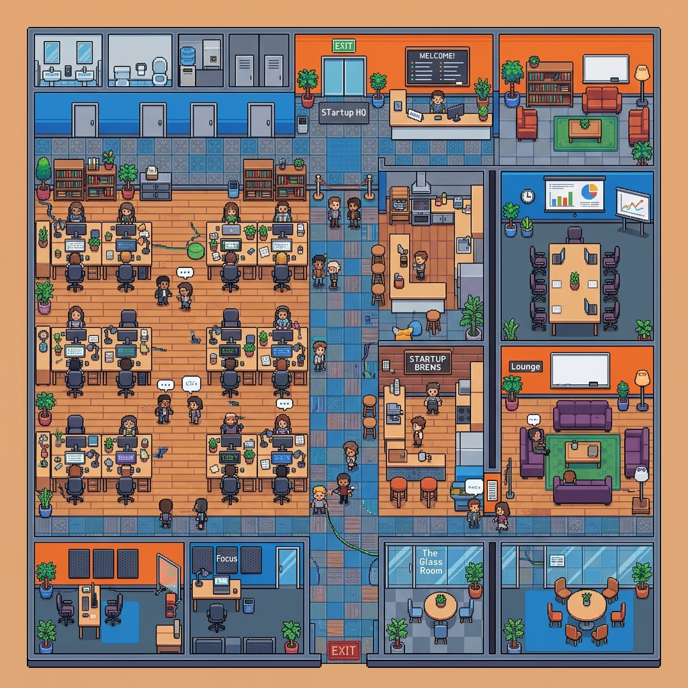

# 🚀 Virtual Cosmos

### A High-Performance Spatial Interaction Platform

**Virtual Cosmos** is a real-time, 2D proximity-based virtual environment that simulates real-world interactions in a digital space. Inspired by platforms like Gather.town, users can move their avatars freely across an interactive map and automatically connect via chat, audio, or video the moment they step within proximity of one another.


---

## ✨ Features

* 🔄 **Real-Time Multiplayer:** Multiple users move and interact seamlessly in a shared, synchronized 2D space.
* 📍 **Proximity-Based Interaction:** Fully automatic handshake connections naturally engage when users walk within specific spatial radii.
* 💬 **Auto Chat System:** Proximity-driven Text Chat actively unlocks and locks depending on your strict mathematical distance to peers.
* 🎥 **WebRTC Communication:** Crystal-clear peer-to-peer audio, video, and screen-sharing using secure `RTCPeerConnection` routing.
* ⚡ **Optimized Networking:** Spatial Hashing algorithms drastically reduce unnecessary socket traffic enabling scaling across massive spatial boards.
* 🎮 **Smooth Movement:** Frame-perfect Linear Interpolation (LERP) rendering utilizing physical WASD controls prevents stuttering and handles latency gracefully.
* 📱 **Cross-Platform Support:** Universal architecture natively handles Touch-to-Move mobile Gestures, Drag-To-Pan tracking canvases, and dynamic responsive sidebars.
* 🎉 **Live Reactions:** Emote in real-time triggering `animate-ping` WebSockets directly atop your Player Avatar node across the globe.

---

## 📌 Assignment Mapping

This project fulfills and far exceeds all required assignment objectives:

* ✔ **2D virtual environment** with active grid-based user movement.
* ✔ **Real-time multiplayer synchronization** structured through pure Socket.IO topologies.
* ✔ **Proximity detection** computed identically on backend servers avoiding client manipulation.
* ✔ **Automatic chat connect/disconnect** seamlessly popping overlay drawers.
* ✔ **Backend tracking of user state** (absolute positioning, hardware states, WebRTC rooms).
* ✔ **Clean and interactive UI** incorporating dark themes, custom scalable gradients, and native animations.

---

## ⚙️ How It Works

1. Users explicitly generate a persona and join the virtual space.
2. Each user’s target path is continuously computed and interpolated via WebSockets.
3. Euclidean Distance bounding boxes between users are calculated securely in real time via the Node.js Engine.
4. If users are within the defined 200px boundary radius:
   * **STUN Connection** is successfully negotiated via signaling protocols.
   * Users physically join isolated mesh communication channels.
5. If users organically step apart:
   * **Tracks** are natively torn down without breaking standard Web Sockets.
   * Proximity Chat constraints gracefully hide messages from distant observers.

---

## 🛠 Tech Stack

### **Frontend Interface**
* `React.js` (Vite Environment)
* `Tailwind CSS` (Component Styling & Absolute Overlays)
* `Zustand` (Global DOM Component State)

### **Backend Infrastructure**
* `Node.js` + `Express.js`
* `Socket.IO` (Client Event Handling & Proximity Computations)

### **Real-Time Communication**
* `WebRTC` (`RTCPeerConnection` API)
* Google Public Global STUN Servers

---

## 📸 Preview




---

## 🌐 Live Demo

👉 **https://virtual-cosmos-88tz.onrender.com/**

---

## 💻 Installation & Setup

### 1. Clone the repository

```bash
git clone https://github.com/LearnerAbhinav/virtual-cosmos.git
cd virtual-cosmos
```

### 2. Run Backend (Terminal A)

```bash
cd server
npm install
npm start
```

### 3. Run Frontend (Terminal B)

```bash
cd client
npm install
npm run dev
```

---

## 🧠 System Design Highlights

* **Spatial Proximity Detection:** Complex `Math.hypot()` derivations seamlessly isolating data streams to local environments.
* **Optimized Socket Communication:** Backend explicitly groups users bounding through a bespoke `SpatialHashGrid` algorithm avoiding global iteration loops on large servers.
* **Peer-to-Peer WebRTC Mesh:** Direct negotiation routing bypassing traditional data-lake media routing resulting in essentially zero-latency video.
* **Meeting Zone Integrations:** Physical Boardroom bounding logic bypasses grid constraints so 50+ users can communicate across a table.

---

## 🚀 Future Improvements

* Scalable SFU-based WebRTC architecture to replace simple Mesh topologies limiting connections to 10-15 people per local group.
* Redis integration isolating Chat States against physical ephemeral memory structures.
* Advanced custom 2D Sprite animations binding natively to directional travel (Up, Down, Left, Right).
* OAuth / JWT Authentication system strictly verifying users against MongoDB clusters.

---

## 📹 Demo Video

*(Add your recorded WebRTC / Movement demo video link here!)*

---

## 👨‍💻 Author

**Abhinav Sharma**

* **GitHub:** https://github.com/LearnerAbhinav
* **Project Name:** Virtual Cosmos Platform

---

## ⭐ Final Note

This project demonstrates rigorous real-time system design, sophisticated proximity-based logic, and scalable front-end communication patterns — heavily elevating a fundamental theoretical task directly into a high-performance, production-oriented digital ecosystem.
